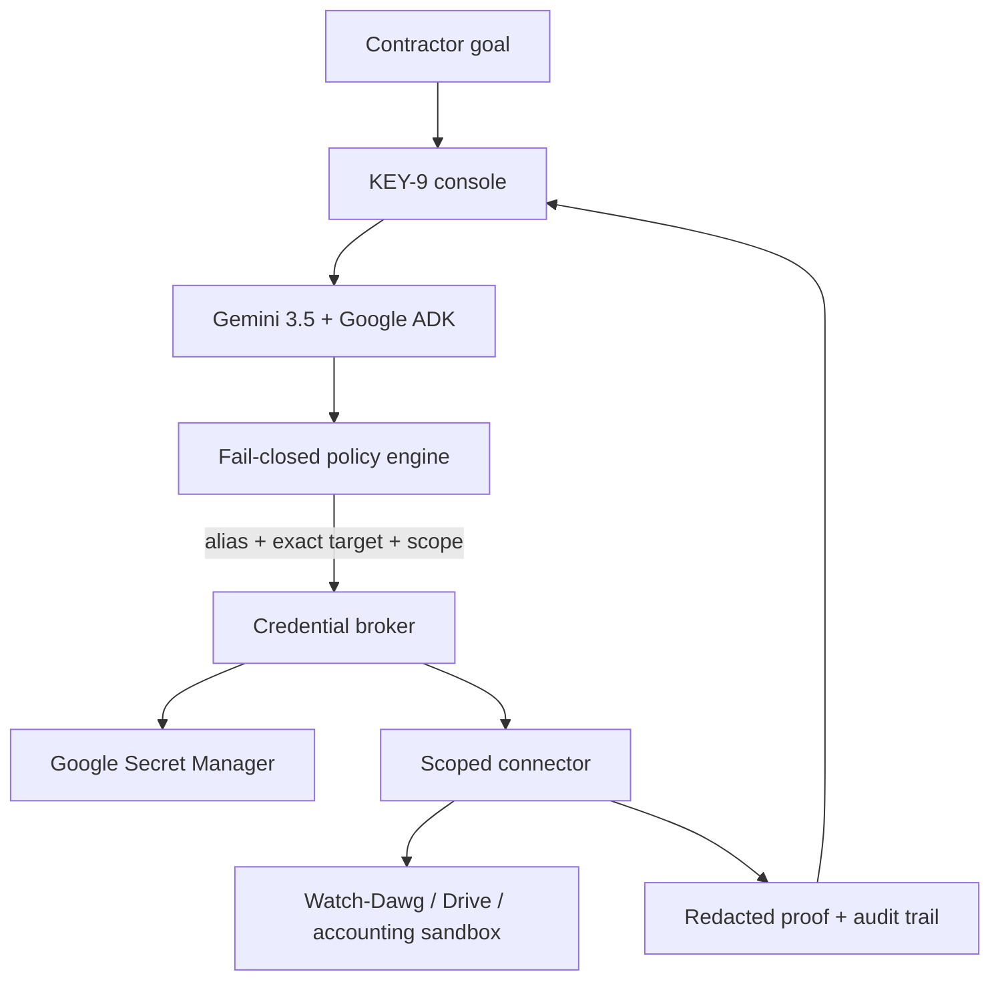

# Watch-Dawg KEY-9

**Give the goal. Never give the secret.**

Watch-Dawg KEY-9 is a secure action broker for contractors and solo operators.
It lets an AI agent complete authenticated, multi-step work without exposing a
password, API key, session token, or service identity to the model, browser,
screen, or application logs.

- Track: **The Taskmaster**
- Built for: **All Things Agentic Hackathon 2026**
- Contest build began: **August 28, 2026**
- Primary stack: **Gemini 3.5 Flash, Google ADK, Cloud Run, Secret Manager**
- Web console: **https://watch-dawg-key9.thebobsomest1.chatgpt.site**

> Contest disclosure: Watch-Dawg AI existed before the contest and is used as
> an integration target and source of seeded contractor workflow data. The
> KEY-9 console, credential broker, fail-closed policy engine, Google ADK agent,
> tests, deployment configuration, and submission materials were created during
> the August 3–31, 2026 submission period.

## The friction

Passwords and API credentials interrupt real work. A contractor may bounce
among field records, receipt folders, vendor portals, accounting tools, and
cloud services just to close one job. Traditional password managers can fill a
login, but they do not understand the operational goal or complete the
workflow. Giving an AI agent unrestricted credentials creates a worse problem.

KEY-9 separates **reasoning** from **identity**:

1. The user states a goal.
2. Gemini plans the work and chooses allowlisted tools.
3. The policy engine validates the credential alias, exact target, requested
   scopes, time-to-live, and approval state.
4. A server-only approval boundary—not the model—authorizes consequential writes.
5. The broker retrieves the secret only at the connector boundary.
6. The connector performs the action and returns a redacted result.
7. The lease is revoked and an audit receipt is recorded.

The model sees the outcome. It never sees the secret.

## Proof-of-action mission

The reproducible contest mission is:

> Close out the Johnson remodel. Gather the missing receipts, reconcile labor
> and materials, and prepare the accounting export.

KEY-9 then:

- plans a bounded six-step mission;
- reads 18 time entries and 27 progress photos from seeded Watch-Dawg data;
- collects three receipt records through the `drive.receipts` alias;
- reconciles the receipt total against the material ledger;
- surfaces an $86.42 mismatch instead of hiding it;
- prepares a reversible accounting export; and
- holds the consequential external write until owner approval.

The public demonstration never stores or accepts real credentials.

## Architecture



The critical trust boundary is between the ADK tools and the credential broker.
Tool inputs contain only aliases such as `drive.receipts`; the Secret Manager
resource mapping is controlled by server configuration and cannot be selected
by the model.

## Security invariants

- **No model secret access:** prompts and tool results contain aliases only.
- **Exact target binding:** `api.watch-dawg.ai.attacker.example` is denied.
- **HTTPS only:** non-TLS targets are denied.
- **Scope allowlists:** unregistered capabilities are denied.
- **No disclosure scopes:** `secret:reveal`, `password:show`, and similar
  requests are always denied, even if a broader policy is added accidentally.
- **Short leases:** every credential use receives a capped expiry.
- **Single use:** a successful broker invocation revokes its lease immediately.
- **Owner approval:** accounting writes remain held until the private server bridge receives a human approval action; the model-facing tool has no approval parameter.
- **Fail closed:** unknown alias, target, scope, lease, or state means no action.
- **Redacted output:** known secrets and common credential shapes are removed
  before results can reach the model or logs.
- **Sandbox first:** the hosted contest UI uses non-sensitive seeded records.

See [`docs/SECURITY_MODEL.md`](docs/SECURITY_MODEL.md) for the threat model.

## Repository layout

```text
app/
  page.tsx                    Interactive KEY-9 mission console
  api/agent/route.ts          Server-side bridge to ADK with safe fallback
agent-service/
  agents/key9_agent/agent.py  Gemini 3.5 Google ADK agent and tools
  key9_core/policy.py         Exact-target, scope, approval, and TTL checks
  key9_core/broker.py         Late secret injection and immediate revocation
  key9_core/redaction.py      Model/log output redaction
  key9_core/workflow.py       Reproducible Watch-Dawg closeout tools
  tests/                      Security regression tests
  Dockerfile                 Cloud Run image
docs/
  ARCHITECTURE.md             Trust boundaries and event flow
  DEMO_SCRIPT.md              Four-minute unedited demo plan
  DEVPOST_SUBMISSION.md       Submission-ready project copy
  SECURITY_MODEL.md           Assets, threats, controls, limitations
scripts/
  bootstrap-contest-cloud.sh One-command contest Cloud setup
  deploy-cloud-run.sh         Reproducible Google Cloud deployment
  smoke-cloud-run.sh          Health and ADK discovery checks
```

## Run the web console

Requirements:

- Node.js 22.13 or newer
- npm

```bash
npm install
npm run dev
```

The console uses its deterministic sandbox until `KEY9_AGENT_URL` is set on the
server. Never put a Google API key or connector credential in a
`NEXT_PUBLIC_*` variable.

## Run and test the agent service

Requirements:

- Python 3.10 or newer

```bash
cd agent-service
python3 -m venv .venv
source .venv/bin/activate
pip install -r requirements.txt
PYTHONPATH=. python -m unittest discover -s tests -v
export KEY9_BRIDGE_TOKEN="replace-with-a-long-random-server-only-value"
uvicorn main:app --host 127.0.0.1 --port 8080
```

Verify the local service:

```bash
curl http://127.0.0.1:8080/healthz
curl -H "x-key9-bridge-token: $KEY9_BRIDGE_TOKEN" \
  http://127.0.0.1:8080/list-apps
```

Expected app list:

```json
["key9_agent"]
```

## Deploy to Google Cloud Run

Use a dedicated Google Cloud project or a dedicated service account with only
the permissions the demo needs. The agent can run against Vertex AI using the
Cloud Run service identity, so no Gemini API key is committed to the project.

```bash
export GOOGLE_CLOUD_PROJECT="your-project-id"
export GOOGLE_CLOUD_RUN_REGION="us-central1"
export GOOGLE_CLOUD_LOCATION="global"
export KEY9_GEMINI_MODEL="gemini-3.5-flash"
export KEY9_BRIDGE_SECRET="key9-bridge-token"
./scripts/deploy-cloud-run.sh
```

The script enables the required APIs and deploys `agent-service/` to Cloud Run.
Before running it, create the named Secret Manager secret and grant the Cloud
Run service account access to that one secret. After deployment, set the
server-only `KEY9_AGENT_URL` and `KEY9_AGENT_TOKEN` values for the web console.
The token value must match the Secret Manager value; neither setting may use a
`NEXT_PUBLIC_*` name.

For the contest deployment, Google Cloud Shell can perform the complete API,
IAM, secret, and Cloud Run setup in one command sequence:

```bash
git clone --branch key9-contest https://github.com/bobhay75/Watch-Dawg-AI.git
cd Watch-Dawg-AI/key9
bash ./scripts/bootstrap-contest-cloud.sh
```

Cloud Run stays in `us-central1`, while Gemini 3.5 Flash uses Vertex AI's
`global` location. The bootstrap writes the Site bridge URL and private token
to `key9-sites-env.txt`; add those two values directly to the Site production
environment and never commit or share that file.

For production secrets, configure a server-only alias map whose values are
exact Secret Manager version resource names:

```json
{
  "watchdawg.production": "projects/PROJECT/secrets/watchdawg-api/versions/1",
  "drive.receipts": "projects/PROJECT/secrets/drive-receipts/versions/1",
  "accounting.export": "projects/PROJECT/secrets/accounting-export/versions/1"
}
```

Do not use `latest` for consequential production actions; pin and rotate an
explicit version so an audit record identifies the exact credential revision.

## Call the deployed ADK agent

The ADK API server exposes its standard session and run endpoints:

```bash
export KEY9_AGENT_URL="https://SERVICE-URL.run.app"
export KEY9_AGENT_TOKEN="the-private-bridge-token"

curl -X POST \
  "$KEY9_AGENT_URL/apps/key9_agent/users/demo/sessions/mission-1" \
  -H "content-type: application/json" \
  -H "x-key9-bridge-token: $KEY9_AGENT_TOKEN" \
  -d '{"sandbox": true}'

curl -X POST "$KEY9_AGENT_URL/run_sse" \
  -H "content-type: application/json" \
  -H "x-key9-bridge-token: $KEY9_AGENT_TOKEN" \
  -d '{
    "app_name": "key9_agent",
    "user_id": "demo",
    "session_id": "mission-1",
    "new_message": {
      "role": "user",
      "parts": [{
        "text": "Close out the Johnson remodel. Gather the missing receipts, reconcile labor and materials, and prepare the accounting export."
      }]
    },
    "streaming": false
  }'
```

## Tests and current verification

- Web lint: passing
- Web production build: passing
- Policy/broker/workflow regression tests: **14/14 passing**
- ADK server import: passing with `google-adk 2.8.0`
- ADK discovery: returns only `key9_agent`
- `/healthz`: passing
- `/v1/security-posture`: passing

The Gemini-backed Cloud Run execution is the remaining environment-dependent
verification. The UI identifies sandbox mode until that deployment is connected.

## Honest limitations

- The contest demo uses seeded Watch-Dawg, receipt, and accounting records.
- The accounting connector prepares a sandbox export; it does not modify a
  real QuickBooks account.
- The current deployment uses in-memory ADK sessions. Firestore or Agent
  Runtime memory is required before persistent personal use.
- KEY-9 is not yet an Android Credential Provider, VPN, or general browser
  autofill replacement.
- This is a security architecture prototype, not an audited password manager.
  Do not place real personal passwords in the public contest demonstration.

## License

Copyright © 2026 Robert J. Hayes. All rights reserved during the hackathon.
