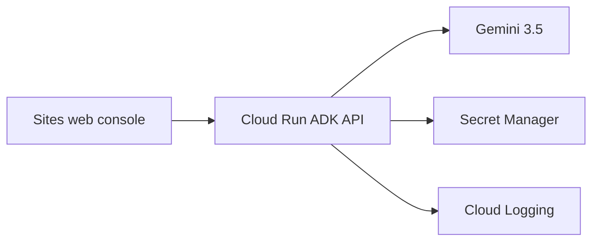

# Architecture and trust boundaries

## Components

| Component | Responsibility | May access plaintext secrets? |
|---|---|---:|
| KEY-9 console | Capture a goal, show progress, request owner approval | No |
| Gemini 3.5 / Google ADK | Plan work and select bounded tools | No |
| Policy engine | Validate alias, exact host, scope, TTL, and approval | No |
| Credential broker | Resolve an approved alias and inject it into one connector call | Briefly, in process |
| Secret Manager | Store versioned secret material under IAM | Yes |
| Connector | Perform one scoped service action | Briefly, for that call |
| Redactor / audit writer | Remove secret shapes and record decision metadata | No |

## Runtime flow

```mermaid
sequenceDiagram
    actor Owner as Contractor
    participant UI as KEY-9 Console
    participant ADK as Gemini + ADK
    participant Policy as Policy Engine
    participant Broker as Credential Broker
    participant Target as Scoped Connector

    Owner->>UI: Close out Johnson remodel
    UI->>ADK: Goal and sandbox job ID
    ADK->>Policy: alias + target + scopes
    Policy-->>ADK: allow, deny, or approval required
    Policy->>Broker: Short-lived lease
    Broker->>Target: Inject secret at request boundary
    Target-->>Broker: Operational result
    Broker-->>ADK: Redacted result; lease revoked
    ADK-->>UI: Evidence and approval hold
    UI-->>Owner: Proof of action
```

## Deployment



The console's `/api/agent` route is the only browser-to-agent bridge. It rejects
secret-like input, creates an isolated ADK session, sends the operational goal,
and returns only the final redacted proof. If Cloud Run is unavailable, the
bridge fails closed to the disclosed deterministic sandbox.

## State

The contest deployment deliberately uses ephemeral ADK sessions. It contains no
personal passwords and avoids implying persistent production safety. A later
personal deployment should use Firestore or Agent Runtime memory for signed
mission records while keeping credential material exclusively in Secret Manager
or a user-owned vault.
